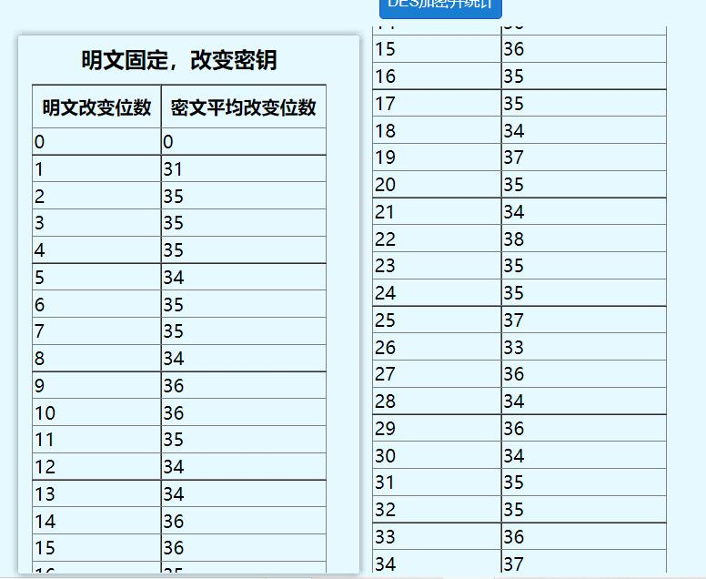

# DES算法实验报告

## 一、实验要求

1.  网上搜索DES的源代码。 

2. 利用DES源代码实现下面功能： 

   + 给定某个Sbox的输入差分情况下，计算所有输入对和所有Sbox输出差分的分布情况 

   + 统计DES算法在密钥固定情况，输入明文改变1位、2位...64位时。输出密文位数改变情况。 

   + 统计DES算法在明文固定情况，输入密钥改变1位、2位...64位时。输出密文位数改变情况。 
     为了具有客观性，2，3小题需要对多次进行统计，并计算其平均值。

     

## 二、运行环境

1. 推荐使用EDGE、Firefox、chrome浏览器运行程序。
2. 直接在DES加密算法作业目录下双加打开`index.html`文件。

## 三、演示与运行结果

### 3.1 计算可能的输入对和Sbox输出差分的分情况

1. 输入差分`000001`
   + 
2. 运行结果
   + 

### 3.2 统计密钥固定情况下的输出密文改变位数

1. 输入明文：`nothingstays`
2. 输入密钥：`default`
3. 统计次数默认为10次
4. 运行结果
   + 
   + 
   + 
5. 分析：密文的改变位数在32位左右。

### 3.3 统计明文固定情况下的输出密文改变位数

1. 输入明文：`nothingstays`
2. 输入密钥：`default`
3. 统计次数默认为10次
4. 运行结果
   + 
   + 
   + 
5. 分析：最终密文的改变位数也在32位左右。

## 四、总结

无论是密钥固定、明文改变，还是明文固定、密钥改变；无论每次改变几位，最终密文的改变位数都为在32左右，也即总的64位的一半。每次都只变化50%的位数，使得企图通过该改变密钥或明文、根据密文变化来分析的攻击者根本难以分析出结果。