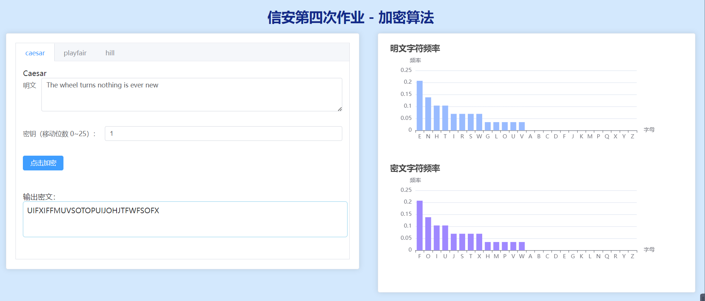
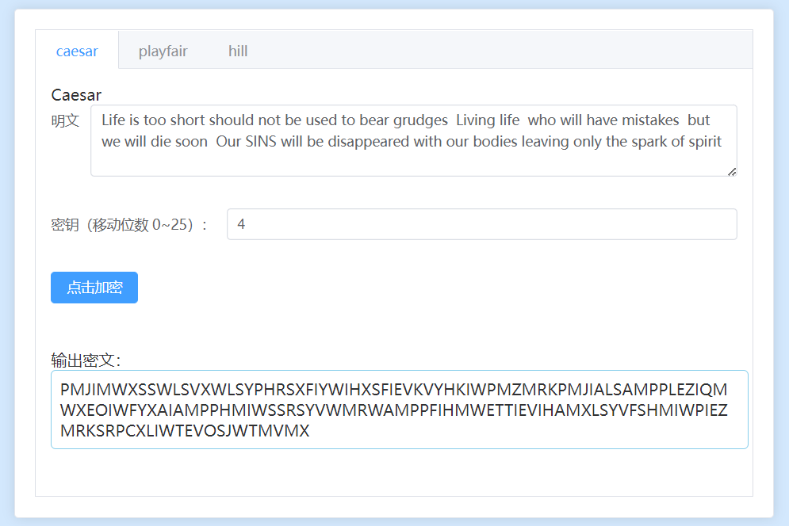
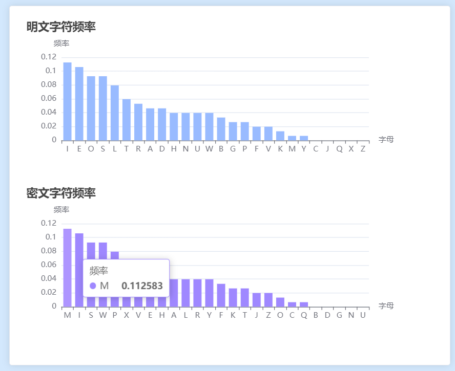
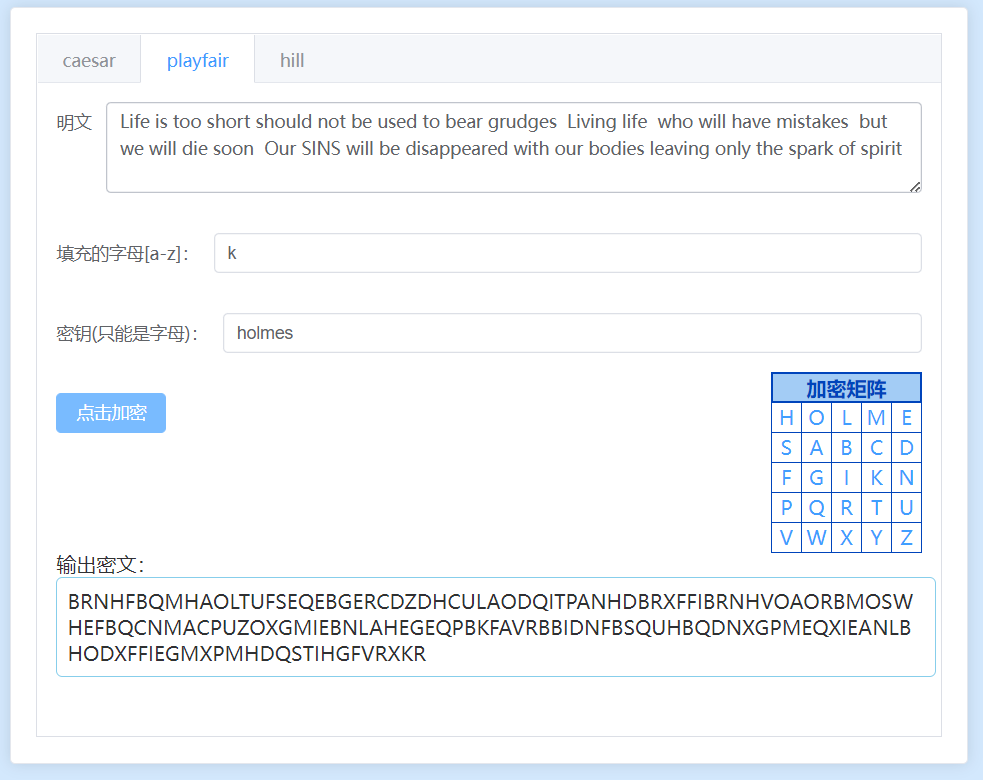
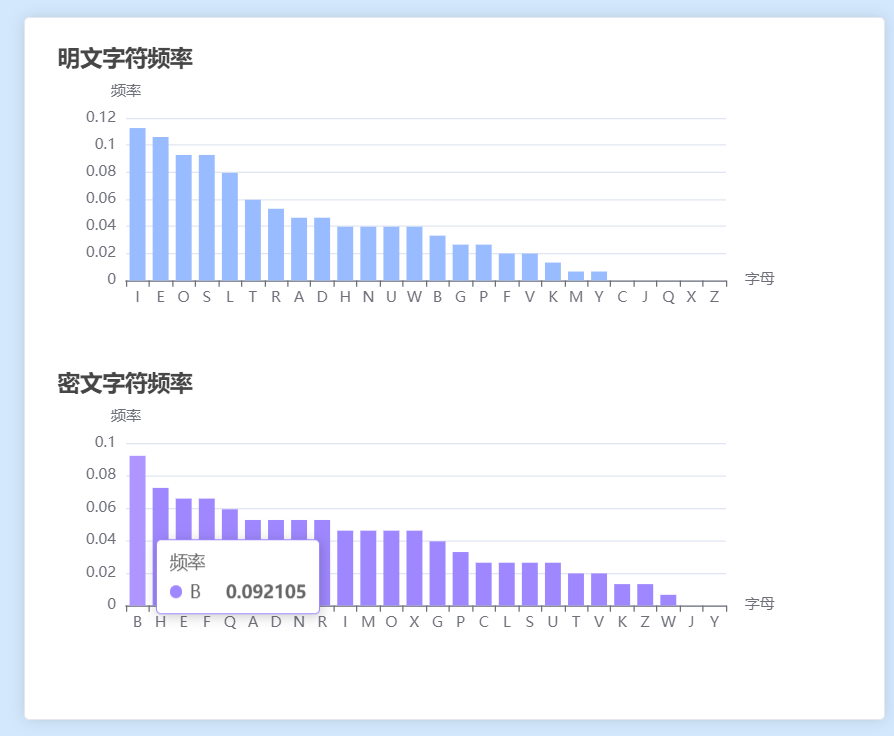
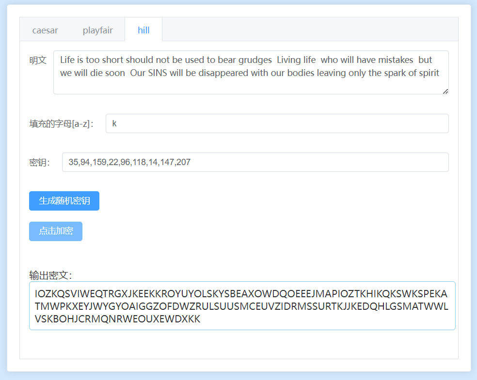
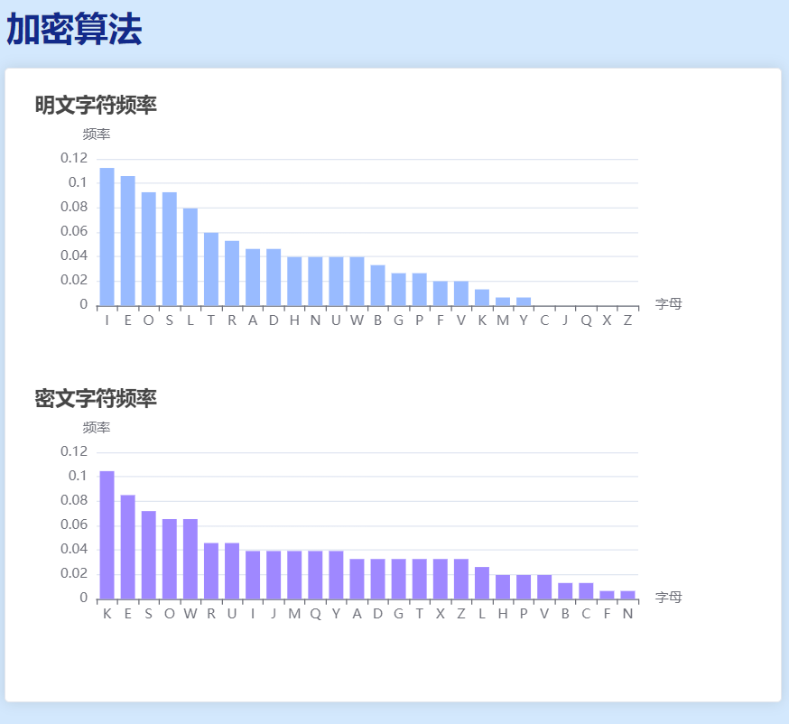

# encryption-algorithms

# Caesar、Playfair、Hill加密算法报告

## 一、项目介绍

+ 项目基于`html`、`css`、`javaScript`技术，采用前端框架`vue3`+`element-plus`开发，实现友好的可视化界面，提供加密算法`Caesar`、`Playfair`和`Hill`的操作演示。

## 二、运行环境与指引

1. 下载项目目录中的`dist`文件夹。
2. 在浏览器运行`index.html`文件即可运行程序。
3. 推荐使用`Edge`、`FireFox`、`Chrome`浏览器打开。

## 三、用户功能简介

### 1. 系统界面

+ 

### 2. 功能

1. Caesar算法演示
   + 用户可输入明文，只能是英文字符或者空格
   + 用户可输入密钥，数字0-25
   + 输出密文，统计频率
2. Playfair算法演示
   - 用户可输入明文，只能是英文字符或者空格
   - 用户可输入密钥，只能是英文字符，输出加密矩阵
   - 输出密文，统计频率
3. Hill算法演示
   - 用户可输入明文，只能是英文字符或者空格
   - 用户可输入密钥，输入3*3的数字加密矩阵，以逗号隔开
   - 用户可点击生成随机密钥
   - 输出密文，统计频率
4. 可视化统计明文和密文字符频率
   - 条形图可视化展示统计结果

## 四、演示报告

### 1. Caesar算法演示

+ 输入明文

+ 输入密钥 4

+ 点击加密
  

+ 明文和密文字符频率

  

### 2. Playfair算法演示

+ 输入明文

+ 输入密钥 `holmes`

+ 点击加密
  

+ 明文和密文字符频率

  

### 3. Hill算法演示

+ 输入明文

+ 输入密钥 4

+ 点击加密
  

+ 明文和密文字符频率

  
