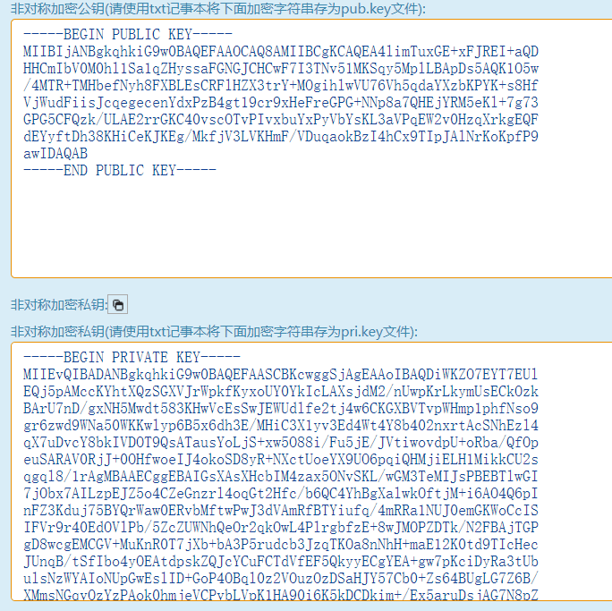
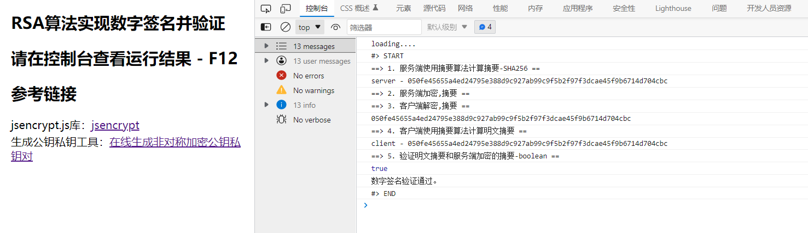

# 数字签名作业


## 一、实验要求

+ 编程，利用RSA，Hash实验数字签名和验证。


## 二、实验目的

+ 了解SHA-256单向散列函数算法，计算字符串或文件的hash值。
+ 进一步理解RSA加密算法，体会RSA的实际使用。
+ 熟悉数字签名的过程，编程模拟实现。


## 三、实验方法

1. 选择语言提供的Hash函数，计算数据的Hash值 
2.  用私钥对 Hash值 进行签名， 
3.  用公钥对签名值进行验证。 


## 四、设计与代码实现

+ 场景设计：服务端使用SHA-256散列函数计算明文的hash摘要，使用RSA加密算法私钥加密摘要进行签名。传输给客户端之后，客户端使用同对的RSA的公钥解密获得hash-1，再次使用SHA-256散列函数计算对应明文的摘要hash-2，比较两个hash值验证签名有效性。

+ 使用JavaScript语言编程，利用 `jsencrypt` 实现RSA加密。

+ 首先自动生成密钥对，私钥保存在服务端不公开，公钥发布。

  

+ 服务端计算摘要并签名。

  ```js
      // 2. 服务端加密,摘要
      console.log("==> 2. 服务端加密,摘要 ==");
      var encrypted = encrypt.encrypt(desMsg_server);   
  ```

  

+ 客户端解密，计算摘要后验证。

  ```js
     // 3. 客户端解密,摘要
      console.log("==> 3. 客户端解密,摘要 ==");
      var uncrypted = decrypt.decrypt(encrypted);  
      console.log(uncrypted);
  
  
  	let verify = desMsg_client == uncrypted;
      console.log(verify);
      if (verify) console.log("数字签名验证通过。")
      else console.log("Worning！传输信息被篡改！")
  ```

  


## 六、程序运行结果

+ 


## 七、分析并解释 《中华人民共和国电子签名法(2019修正)》的修订

> 2019年4月3日，国务院常务会议通过《电子签名法》修正案草案，删除了“土地、房屋等不动产权益转让”不适用“电子签名、数据电文”的条款，为**房地产交易中应用电子合同、电子签名提供了明确的法律依据**；4月23日，第十三届全国人民代表大会常务委员会第十次会议，正式对《电子签名法》做出修改，放宽电子签名使用范围。


### 《电子签名法》修改前后对比

据《电子签名法》第三条：民事活动中的合同或者其他文件、单证等文书，当事人可以约定使用或者不使用电子签名、数据电文。

当事人约定使用电子签名、数据电文的文书，不得仅因为其采用电子签名、数据电文的形式而否定其法律效力。

+ **修改前**

+ （一）涉及婚姻、收养、继承等人身关系的；

  （二）涉及土地、房屋等不动产权益转让的；

  （三）涉及停止供水、供热、供气、供电等公用事业服务的；

  （四）法律、行政法规规定的不适用电子文书的其他情形。

+ **修改后**

+ （一）涉及婚姻、收养、继承等人身关系的；

  （二）涉及停止供水、供热、供气等公用事业服务的；

  （三）法律、行政法规规定的不适用电子文书的其他情形。

  基于这次修订，意味着今后涉及土地、房屋等不动产权益转让、供电公用事业服务适用“电子签名、数据电文”。


### 什么是合法有效电子签名

随着法律的进一步完善、国家相关政策的推广支持，电子签名的应用也日渐成熟。根据《电子签名法》第十三条：电子签名同时符合下列条件的，视为可靠的电子签名：

1. 电子签名制作数据用于电子签名时，属于电子签名人专有；
2. 签署时电子签名制作数据仅由电子签名人控制；
3. 签署后对电子签名的任何改动能够被发现；
4. 签署后对数据电文内容和形式的任何改动能够被发现。

**当事人也可以选择使用符合其约定的可靠条件的电子签名。**


-----

